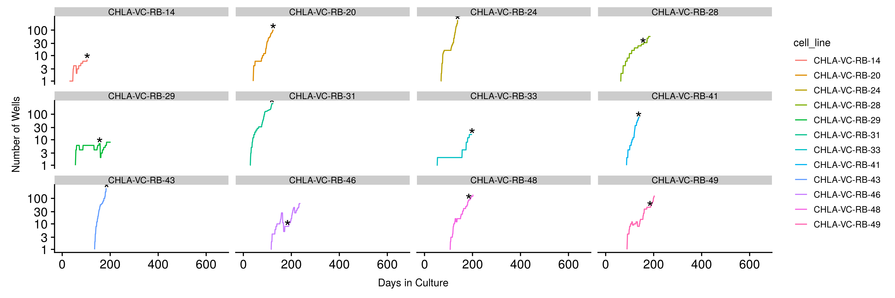
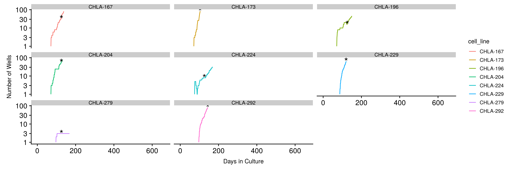
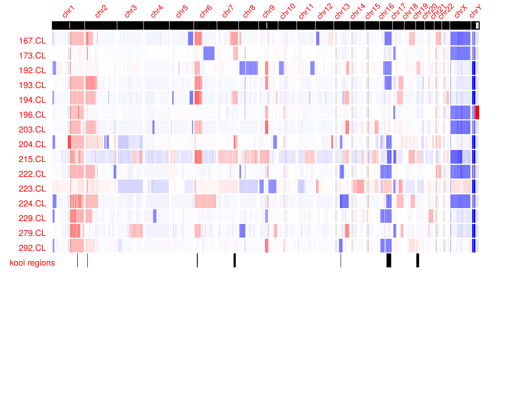
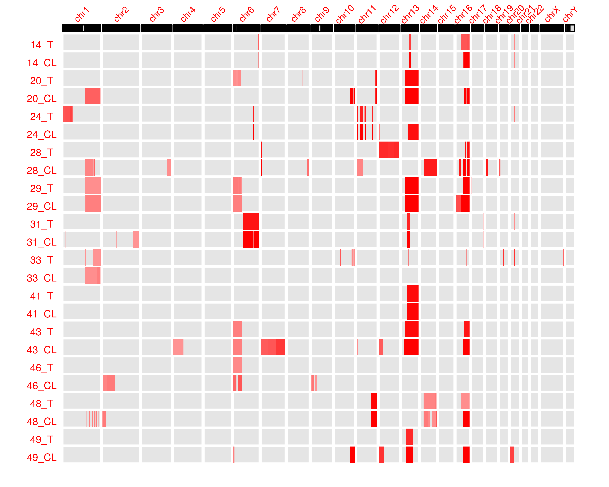
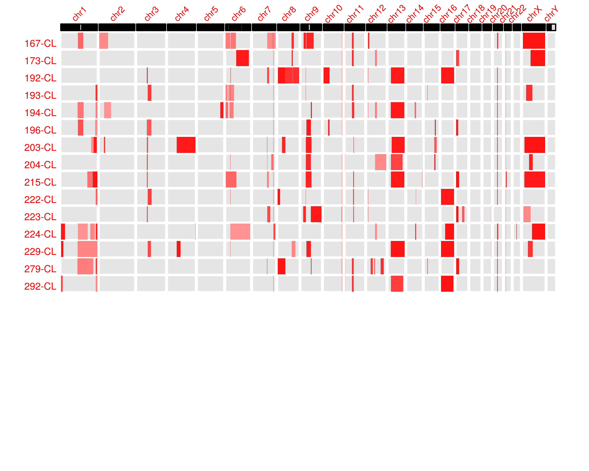

Correspondence: David Cobrinik

```{r setup, include=FALSE}
knitr::opts_chunk$set(echo = FALSE, warning = F, message = F)
doc_type <- knitr::opts_knit$get("rmarkdown.pandoc.to")

options(knitr.kable.NA = '')

library(kableExtra)
library(pander)
library(flextable)
library(DT)
library(tidyverse)
library(glue)

embed_data <- function(x= mtcars, filename= "file.csv", label= "Get data"){

  # Create encoded Base64 datastream 
  encode_data= function(x){
    write.table(x, "./file.csv", sep = ",", row.names = FALSE)
    enc= sprintf('data:text/csv;base64,%s', openssl::base64_encode(paste0(readLines("./file.csv"), collapse="\n")) )
    unlink("./file.csv")
    return(enc)
  }

  # String result ready to be placed in rmarkdown
  paste0("<a download='", filename, "' href=", encode_data(x), ">", label, "</a>")

}

print_tl <- function(tname, tt){
  print(glue(tname, " ", dim(tt)[1], sep = " "))  
}

```

# Abstract

We carried out exome sequencing on twelve retinoblastoma tumors along with matched normal and tumor-derived cell lines.

We identified variants targeting BCOR and SCNAs known to arise in retinoblastoma as well as novel recurrent variants in… of which xxx was enriched during cell line establishment . The ten retinoblastoma cell lines with fully characterized genetic background are a resource for studies of the effects of such variants on tumor progression.
Introduction

# Introduction

Cancers develop in response to successive genetic or epigenetic changes in a susceptible cell-of-origin.  After a tumor has formed, it may undergo continuous rounds of secondary mutation and selection of more aggressive phenotypes.  Many secondary alterations may be present in only a subset of tumor cells, as different clones compete for dominance. All of this implies that mutations that occur at sub-clonal levels can sharply increase tumor aggressiveness via their combined effects in the diverse sub-clones that comprise a tumor. Identification of the initating oncogenic lesion along with progression-related genomic changes by identification of sub-clonal mutations in a tumor population may provide insights into progression-related signaling pathways that enhance tumor aggressiveness. Such an analysis may aid the development of targeted therapies in suitable experimental models.  

At present, many methods for detecting sub-clonal genomic alterations rely on regional or temporal sampling of tumors. Recent developments of algorithms to reconstruct the evolutionary history of tumors allow inference of the sequence of somatic mutations [@jollyTimingSomaticEvents2018].


. For example, can detect variants in ~ n% of alleles with read depth of z. (practical limits of variant detection with latest methods).  (single cell sequencing allow greater detection of rare subclones (either with focused amplification or greatly increased read depth per cell). 

Most methods attempt to reconstruct a phylogenetic tree and to estimate subclones based on frequencies of single nucleotide variants. A majority rely on bulk sequencing data. Their resolution is limited, however, due to the nature of data collected. Approaches using single cell sequencing data are able to achieve better estimation of phylogeny, but suffer from missing data. As a result, most single cell methods have adapted algorithms for managing these missing data [@jahnTreeInferenceSinglecell2016; @miuraComputationalEnhancementSinglecell2018; @rossOncoNEMInferringTumor2016; @zafarSiFitInferringTumor2017]. 

Please Review Key Papers Here ...

However, the importance of a subclonal lesion may be difficult to evaluate.  


 in a tumor population may provide insights into progression-related signaling pathways that enhance tumor aggressiveness.

## General and brief background of retinoblastoma

Retinoblastoma is a pediatric retinal cancer that initiates in most cases in response to biallelic inactivation of the RB1 gene and rarely (in 1-2% of cases) in response to MYCN amplification [@dimarasRetinoblastoma2015]. The tumors appear to originate in RB-deficient or MYCN over-expressing cone photoreceptor precursors[@Singh2018; @xuRbSuppressesHuman2014a] (Sing et. al in preparation) and to proceed through an indolent premalignant phase with retinoma features prior to overt tumorigenesis.  In addition to RB loss, most RB1-null retinoblastomas have recurrent somatic copy number alterations such as 1q+, 2p+, 6p+, and 16q- [@kooiMetaAnalysisRetinoblastomaCopy2016]. These retinoblastoma SCNAs increase in frequency with patient age and tumor size, suggesting that they are acquired during tumor progression.  Whole genome or whole exome sequencing of 94 [@grobnerLandscapeGenomicAlterations2018; @kooiSomaticGenomicAlterations2016; @zhangNovelRetinoblastomaTherapy2012] tumors revealed that retinoblastomas also have recurrent inactivating mutations of BCOR (in ~ 6% of cases) and [inactivating or activating?] mutation of CREBBP (in 2%) (ref?).  Mutations in additional genes have also been observed in single retinoblastomas but their status as progression drivers or innocuous passengers is unclear.  

Since diverse low-frequency mutations may target a single signaling pathway [@molenaarSequencingNeuroblastomaIdentifies2012], identification of all significantly recurrent (significantly mutated?) genes may provide important mechanistic insights and therapeutic targets. Even in the absence of recurrent mutation a series of “private” mutations may be inferred  to affect a common pathway when they occur in a mutually exclusive manner and with supportive biologic information, since diverse low-frequency mutations may target a single signaling pathway[@molenaarSequencingNeuroblastomaIdentifies2012], 

Indeed, a recent study implies that all recurrently mutated oncogenic variants may be revealed only after analysis of ~500 – 1,000 tumors of each type (check #s) [@lawrenceDiscoverySaturationAnalysis2014]. Thus, it is important to identify and characterize effects of additional recurrent variants.

A further goal of genomic studies is to define  mechanisms through which recurrently mutated genes or signaling pathways promote tumorigenesis.  For example, restoration of RB suppresses retinoblastoma cell growth only when there is sufficient RB expression[@cobrinikRbInducesProliferative2006]. However, effects of additional genomic changes in the context of human retinoblastoma cells have not been explored. In part this is because genomic alterations in retinoblastoma cell lines have not been well characterized. 

Here we want to identify mutations that recur at subclonal frequencies during tumor progression and establish cell lines with such mutations that may be functionally examined.

The role of secondary mutations in progression of retinoblastoma has been previously studied, but the comparatively shallow depth of sequencing used may have limited detection of low frequency variants associated with progression of retinoblastoma(Kooi, Mol, Massink, Ameziane, et al. 2016).


## Lack of validated cell lines with known genetic background to explore Rb progression.

Canonical retinoblastoma cell line models such as *Weri* and *Y79* are well characterized but are subject to genetic drift after long-term laboratory passaging. In addition, evidence indicates that Y79 and Weri lines share extensive genetic background such that Weri may be considered a sub-line of Y79 [@bejjaniRB116RB1Retinoblastoma2012]. Models of RB^MYCNA^ are rare relative to canonical Rb -/- cell lines. A shortage of low passage, well-characterized retinoblastoma cell lines may limit study of complex genetic variants beyond the classical two-hit model, in particular *MYCNA* retinoblastoma. Retinoblastoma cell lines with defined SNV and SCNA profiles also allow the study of retinoblastoma progression due to variants present at subclonal levels. 

# Methods

## Sample Acquisition

Untreated retinoblastoma tumor samples were obtained with informed consent under approved IRB protocols immediately following enucleation. One fraction of tumor was rapidly frozen in liquid nitrogen. A second fraction was placed in culture to establish cell lines. Matched normal DNA samples were obtained from mesenchymal cells isolated from orbital fat pad tissue collected during enucleation.

## Establishment and propagation of retinoblastoma cell lines 
Dissociated retinoblastoma cells were prepared after culturing freshly explanted tumors in RB culture medium consisting of IMDM (Mediatech Inc.) with 10% FBS (Sigma-Aldrich), 2mM glutamine (Mediatech Inc), 55uΜ beta-mercaptoethanol (Sigma-Aldrich), and 10ug/ml insulin (Humulin-R, Eli Lilly and Company) at 37o C in a humidified incubator with 5% CO2[@xuRbSuppressesHuman2014a]. 

## DNA isolation and Sequencing 
Flash-frozen tumor samples were dissociated by triteration and immediately prepared for DNA extraction. In the same fashion, cryopreserved cell lines and normal MSC samples were dissociated and DNA was isolated using the Qiaamp DNA Minikit (Qiagen, Hilden, Germany). A minimum of 1 ug of DNA was submitted for DNA Exome Sequencing on Illumina HiSeq by Macrogen Inc. (Seoul, South Korea) and BGI (Shenzhen, China). A sequencing depth of 150x for cell line and matched normal samples and 300x for tumor samples was requested. 

## Variant Calling Pipeline
1. Exome capture sites were defined according to the Sureselect V5 Capture Library (Agilent). 
2. Sequences were aligned to UCSC hg19 human reference genome using bwa [@Li2013]. 
3. Following the GATK best practices workflow for somatic variant discovery, 
  1. duplicate reads were removed and base quality scores were recalibrated. 
  2. Variant calling was done using GATK Mutect2[@depristoFrameworkVariationDiscovery2011; @cibulskisSensitiveDetectionSomatic2013] and Strelka2[@kimStrelka2FastAccurate2018] for somatic variants between tumor and matched-normal samples. 
  3. Putative germline variants were assessed by assembling a panel of normals with mutect2 in variant detection mode. 
4. Variants were annotated using Ensembl Variant Effect Predictor [@McLaren2016]
5. Variants were filtered using the VariantAnnotation R package from Bioconductor [@Obenchain2014]

## Variant Filtration
After annotation of variant call sets from both Mutect2 and Strelka, each set was filtered by the same criteria: 

1. Variants were removed if they were documented in the Genome Aggregation Database (gnomAD) [@Lek2016] at an allele frequency greater than ten percent. 
2. All admitted variants passed the variant caller's internal filter. 
3. Variants were removed if they appeared in the matched normal at greater than Low frequency (<5% VAF ???) . 
4. Variants were also filtered out if they appeared in a panel of normals at Low frequency (<5% VAF ???). 
5. Two variants were considered identical when they had identical genomic coordinates, reference and mutant allele sequences, and genotype calls. 

## Somatic Copy Number Alteration
Somatic copy number alteration (SCNA) were detected using the R package CopywriteR which uses off-target reads in targeted sequencing experiments to define a uniformly distributed copy number profile. 

## Allelic Imbalance
Variant sites detected by Mutect2 in any samples were collected into a single .bed file. B allele frequencies for all samples were calculated at these sites. B allele frequency segmentation was performed as described [@staafSegmentationbasedDetectionAllelic2008], yielding a mirrored B allele frequencey (mBAF) representing an abnormal B allele frequency over a given region. A region was designated as having allelic imbalance if mBAF was greater than 0.56 and was designated as having loss of heterozygosity (LOH) if mBAF was greater than 0.7.  

# Results

### Statement of Purpose

We catalogue additional recurrent 

We assembled a series of retinoblastoma tumors and established matched cell lines in which to assess the presence of recurrent genomic changes.

Tumors were primary untreated n% bilateral and y unilateral from patients ranging from 2 to 44 months of age. 

## RB patient characteristics

```{r patient_chars, echo=FALSE, results='asis'}

patient_chars <- read_csv("patient_chars.csv")

if (doc_type == "docx"){
  flextable(patient_chars) %>% 
    autofit()
  # pander(patient_chars, split.cells = 30, split.table = Inf)  
} else {
  knitr::kable(patient_chars) %>% 
    kable_styling()
  
  embed_data(patient_chars, filename="patient_chars.csv", label= '**Table 1: Patient Characteristics**')
}


```
Clinical characteristics of study participants. Clinical sequencing records for four of twelve samples are available in supplementary info, all rb1 clinical variants were recapitulated by exome sequencing with the exception of biallelic promoter methylation reported in sample T-20.

## Cell Line Growth Curves

### VC



### Reynolds



Retinoblastoma cell lines were established from enucleated tumor prior to treatment, then expanded in culture under either of two protocols (Reynolds and VC) and viably frozen at a minimum cell number. For this study, these initial cell lines were thawed and passaged on a schedule of 1-2 days upon color change of phenol red to amber. With an intial volume of 200 ul cell solution per 96 well plate, cells were split 1:2 wells following successive days of sufficient color change. A log of well number based on volume of a 96-well plate was maintained for each cell line, with the first value corresponding to the cumulative days in culture up to initial date of thawing, and correcting for cells banked in liquid nitrogen storage at regular intervals.  **Indicate range of cell # used to start cultures; All are pre-treatment , CHLA, established by either of two protocols (Reynolds and KS)** 

We carried out exome sequencing on twelve retinoblastoma tumors along with matched normal and tumor-derived cell lines. We selected a sequencing depth of 150x for normal and cell line samples and 300x for tumor samples.

## RB1 Status in Tumor and Cell Line Samples

```{r rb1_status, echo=FALSE, results='asis'}

rb1_status <- read_csv("rb1_status.csv") %>%
  select(-end) %>%
  unite(position, chrom, start, sep = ":") %>%
  select(sample, position, AAChange.refGene, everything()) %>%
  identity()

if (doc_type == "docx"){
    flextable(rb1_status) %>% 
    autofit()
} else {
  knitr::kable(rb1_status) %>% 
    kable_styling() %>% 
    collapse_rows(columns = 1, valign = "top")
  
  embed_data(rb1_status, file="rb1_status2.csv", label = '**Table 2: RB1 and MCYNA status in Tumor and Cell Line Samples**')
}

```

Samples are displayed by tumor and cell line id. The estimated number of RB1 alleles subject to SCNA loss is displayed for each sample along with detected LOF mutations to *RB* with variant allele frequency (VAF). Also displayed are determinations of copy-neutral loss of heterozygosity (CN-LOH) with mBAF spanning *RB*. If a copy number gain spanning MYCNA was detected, the sample is labeled *MYCNA*. In most cases RB1 initiation could be accounted for by the sum of alterations in RB1 or through *MYCNA*, with the exception of samples 20-T and 20-CL. These samples were determined to be subject to *RB1* promoter methylation based on clinical sequencing records. 

## Somatic Variants

A total of 16,348 (16,348/643,581; 2.5%) somatic variants were detected (# for x tumor normal pairs; # for y cell line-normal pairs; [can this be plotted as for Lawrence 2014 supp fig S1 (and Lawrence 2013 Fig 1?). The median somatic mutation frequency (x/Mb) is similar to that of nnn tumor [similar to previous analyses? did Kooi also calculate?) (Figure)  After further filtering by pathogenicity, functional annotation, and variant allele frequency (VAF) in gnomAD, a final tally of 220 variants potentially pathogenic variants were found (679/16,348; 4%). (Table 3). did this take into account the criteria in Lawrence 2014?

### Mutect2 (exclusively vc samples)
* Following variant calling (with respect to matched normal) and filtering by the variant caller's internal filtering criteria, a total of 9938 tumor variants and 2450 cell line variants were found. 
* After filtering out variants that were present in the panel of matched normal controls, 3572 tumor variants and 971 cell line variants were recorded. 
* After further filtering by pathogenicity, functional annotation, and variant allele frequency (VAF) in gnomAD, a final tally of 460 tumor variants and 218 cell line variants were found. Details can be found in *Table 4*.

```{r, echo=FALSE, results='asis'}

reported_m2_vc_somatic_vars <- read_csv("SNV/reported_m2_vc_somatic_variants.csv") 

# kable(t_cl_vars, split.cells = 30, split.table = Inf)
embed_data(reported_m2_vc_somatic_vars, filename="m2_vc_somatic_vars.csv", label= '**Table 3: Somatic Variants in Tumor and Cell Line Samples Mutect2')
```

### Strelka
* Following variant calling (with respect to matched normal) and filtering by the variant caller's internal filtering criteria, a total of 19861 tumor variants 11519 cell line variants were found. 
* After filtering by pathogenicity, functional annotation, and variant allele frequency (VAF) in gnomAD, a final tally of 1279 tumor variants and 632 cell line variants were found. Details can be found in *Table 4*.

```{r, echo=FALSE, results='asis'}

reported_strelka_somatic_vars <- read_csv("SNV/reported_strelka_vc_somatic_variants.csv") 

# kable(t_cl_vars, split.cells = 30, split.table = Inf)
embed_data(reported_strelka_somatic_vars, filename="strelka_vc_somatic_variants.csv", label= '**Table 4: Somatic Variants in Tumor and Cell Line Samples Strelka')
```

Variant numbers may differ from other analyses of RB tumors due to deeper sequencing that enabled variants present at lower VAF to pass variant caller filtration.

## Somatic Variants Shared Between Tumor and Cell Line 

### (mutect2)
```{r, echo=FALSE, results='asis'}


m2_t_cl_vars_file <- "m2_t_cl_vars.csv" 

t_cl_vars_file <- m2_t_cl_vars_file

t_cl_vars_path <- paste0("SNV/", t_cl_vars_file)

t_cl_vars <- read_csv(t_cl_vars_path)

# kable(t_cl_vars, split.cells = 30, split.table = Inf)
embed_data(t_cl_vars, filename=t_cl_vars_file, label= '**Table 5: Variants Recurrrent in Tumor and Cell Line Samples Mutect2')
```

### (strelka)
```{r, echo=FALSE, results='asis'}

strelka_t_cl_vars_file <- "strelka_t_cl_vars.csv" 

t_cl_vars_file <- strelka_t_cl_vars_file

t_cl_vars_path <- paste0("SNV/", t_cl_vars_file)

t_cl_vars <- read_tsv(t_cl_vars_path)

# kable(t_cl_vars, split.cells = 30, split.table = Inf)
embed_data(t_cl_vars, filename=t_cl_vars_file, label= "**Table 6: Variants Recurrrent in Tumor and Cell Line Samples Strelka")
```


Somatic variants shared between matched retinoblastoma tumor and cell line samples included *RB1*, *PAN2*, and , recurrent in six of 12 samples. Additional SNVs including *BCOR*, previously identified [@kooiSomaticGenomicAlterations2016], [@zhangNovelRetinoblastomaTherapy2012]and *NAF1* were not detected in cell line samples but were found in tumor. Recurrent variants included *RB1* and *EP300*, closely related to *CREBBP* identified by [@kooiSomaticGenomicAlterations2016]. Additional somatic variants exclusive to tumor and cell line samples can be found in supplementary info S1.

were any of these in Lawrence 2014 summary of known cancer genes?


Indicate TTL5 changes as one variant 
Table with allele 
(Discussion: BCOR mutation in T28  ‘lost’ in CL 28; suggesting does not help and might hurt growth.  5 of 7 other CNAs were retained (all except 12-) suggesting that the rare BCOR wild type and chr12 normal cell was selected; suggesting that 12- and BCOR mutation were the last changes in the evolution of the tumor (consisstent with BCOR VAF = 0.394); suggesting either selection for two copies of chr 12 or for wild type BCOR.  [also check CL28 for CN-LOH]
(similar points for NAF1)

PAN2 AKAP12: mention increase VAF in cell lines – though not much can be made of it. DO indicate  likely effects of mutation on protein structure and function. 
If they are heterozygous in cancer cell may be dominant acting oncogenic or haplo-insufficent if mutation inactivates a tumor suppressor function. 
Discussion: note prior evidence for role in Cancer (AKAP12) but no prior papers for PAN2; how affects RNA metabolism/processing it may be consistent with Kooi observation that progression is associated with increased RNA biogenesis???
Are EP300 ‘mutations’ also found at very low frequency in other tumors, cell lines, normals in our cohort.

## New Recurrent Somatic Variants
```{r, echo=FALSE, results='asis'}

strelka_three_a_file <- "strelka_3a_genes.csv" 

three_a_file <- strelka_three_a_file
three_a_path <- paste0("SNV/", three_a_file)

three_a_genes <- read_csv(three_a_path)
# kable(three_a_genes, split.cells = 30, split.table = Inf)
embed_data(three_a_genes, filename=three_a_file, label= "**Table 7a: New Recurrrent Somatic Variants from Strelka also identified in Kooi, Zhang, McEvoy")
```

RB33  T and CL SCNA profiles very similar consistent with RB33-CL DNA sample sent before CL culture-related selection-related changes, OR the CL might not have changes, in contrast to all the other cases where at least one major CNA event has taken place in the majority of CL cells. (can confirm VAF in cell line DNA by PCR sanger seq). implies no further selection for the BCOR mutation over ~ 200 days in culture. 


```{r, echo=FALSE, results='asis'}

m2_three_a_file <- "m2_vc_3a_genes.csv" 

three_a_file <- m2_three_a_file
three_a_path <- paste0("SNV/", three_a_file)

three_a_genes <- read_csv(three_a_path)
# kable(three_a_genes, split.cells = 30, split.table = Inf)
embed_data(three_a_genes, filename=three_a_file, label= "**Table 7b: New Recurrrent Somatic Variants from Mutect2 also identified in Kooi, Zhang, McEvoy")
```

See compiled list of variants from [prior rb exome studies](#previously-identified-variants)

Somatic Variants identified as new recurrent by comparision with [@kooiSomaticGenomicAlterations2016; @zhangNovelRetinoblastomaTherapy2012]. Three variants were identified. An alteration in 

## Somatic Copy Number Alterations
Somatic copy number alterations (SCNA) were detected in all twelve samples. Regions of copy number change included 1q, 2p, 6p, 7q and 13q--conistent with [@kooiMetaAnalysisRetinoblastomaCopy2016]. We detected amplification of 2p in the region spanning the MYCN oncogene in sample 24-T and matched cell line. We also found SCNA loss in sample 14-T on the X chromosome covering BCOR, previously implicated in retinoblastoma pathogenesis[@kooiSomaticGenomicAlterations2016; @zhangNovelRetinoblastomaTherapy2012]. 




## SCNA in Kooi peak regions

```{r , echo=FALSE, results='asis'}
vc_seg_overlap_path <- "SCNA/vc_seg_overlap_kooi_peaks.csv" 
vc_seg_in_kooi_peaks <- read_csv(vc_seg_overlap_path)
embed_data(vc_seg_in_kooi_peaks, file="vc_seg_overlap_kooi_peaks.csv", label = "**Table 9: SCNA overlap with Kooi et. al peak regions in vision center tumors and cell lines")
```

```{r , echo=FALSE, results='asis'}

reynolds_seg_overlap_path <- "SCNA/reynolds_seg_overlap_kooi_peaks.csv"
reynolds_seg_in_kooi_peaks <- read_csv(reynolds_seg_overlap_path)  
embed_data(reynolds_seg_in_kooi_peaks, file="reynolds_seg_overlap_kooi_peaks.csv", label = "**Table 10: SCNA overlap with Kooi et. al peak regions in reynolds cell lines**")
```

## Focal SCNAs (BCOR in RB14, MYCN in RB24) 


## Allelic Imbalance Loss of Heterozygosity
Regions of loss of heterozygosity with a threshold of 0.7 mBAF are shown in [supplementary info](#supplementary-info-loss-of-heterozygosity). 


* need to change language "depth of..." to report both allelic imbalance and binary loh value

* look at concordance between 33-t and 33-cl loh and scna in chr16 

* use green to annotate CN-LOH








## Germline Variants

putative germline variants are listed in the table below.

No germline RB1 mutations were detected for the 10 tumors from unilaterally affected patients, consistent with these patients having acquired two somatic RB1 alterations.   
One bilateral pt had 13q focal deletion that included the RB1 gene.  In addition, in a second bilateral case (VCRBVC41) we did not detect a germline variant. However, the tumor showed RB1 LOH, there is likely to be a hidden germline RB1 abnormality, such as promoter mutation (ref) or deep intron mutation (ref). As a less likely possibility, this patient could have a low-level mosaic mutation or promoter methylation that was not detected in the MSC DNA. However, mosaicism seems unlikely to yield bilateral tumors. (let’s check for low VAF changes in normal DNA).  [check Gallie/Lohmann paper and Rushlow MYCNA paper might mention other alternatives to explain lack of RB1 mutation detection) 

```{r potential_germline, echo=FALSE, results='asis', eval=FALSE}

germline_vars <- read_tsv("SNV/m2_germline_variants.csv", sep = ",", header = TRUE)
embed_data(germline_vars, file="germline_variants.csv", label = "germline variants")
```


# Discussion

This study aimed to identify novel genomic abnormalities that recurrently contribute to retinoblastoma tumorigenesis as well as cell lines that harboring such mutations that may be exploited for targeted therapy development. We found that …


## The importance of screening for rare variants via deep sequencing

```{r, ref.label='cgc-intersection'}

```


Using an ensemble variant calling approach using Mutect2 and Strelka variant callers we tried to identify any recurrent mutations identified by prior studies [@grobnerLandscapeGenomicAlterations2018; @kooiSomaticGenomicAlterations2016; @mcevoyRB1GeneInactivation2014; @zhangNovelRetinoblastomaTherapy2012]. We detected recurrent mutations in `r paste(unique(three_a_genes$SYMBOL), collapse = ", ")`, previously detected in [@kooiSomaticGenomicAlterations2016; @zhangNovelRetinoblastomaTherapy2012]. 

It is important to note that each study implemented varied criteria for reporting a variant as a somatic mutation. [@kooiSomaticGenomicAlterations2016] required:

Kooi
1. variants have depth greater than ten reads
2. GATK variant qual > 50
3. FisherStrandBias > 60
4. Variants were present at a rate less than 0.1% in Exome Sequencing Project version 6500 and 1000 genomes.
5. Variants were marked “PASS” by GATK
6. Variants were truncating (stop-gain/loss, frameshift-gain/loss, and INDELs) or splice site mutations or amino acid substitutions
7. Variants were scored pathogenic by at least 2 out of 4 pathogenicity predicting programs (SIFT, LJB_LRT_Pred, PolyPhen2, and MutationTaster).

Zhang
1. SNVs were detected by Somatic Sniper

2. All predicted SNVs were filtered through a SNV false-positive filter developed at the Genome Institute that is based on a standard set of criteria including mapping quality score, average supporting read length, average position of the variant in the read, strand bias and the presence of homopolymer. 

3. Indels were called using modified SAMtools, Pindel and GATK. 

4. Variants including SNVs and indels were detected Bambino using: (1) a high quality threshold for pooled tumor and matching normal bam files (min-quality=20, min-flanking-quality=20, min-alt-allele-count=3, min-minor-frequency=0, broad-min-quality=10, mmf-max-hq-mismatches=4, mmf-min-quality=15, mmf-max-any-mismatches=6; (2) a low quality threshold for pooled tumor and matching normal bam files (min-quality=10, min-flanking-quality=10, min-alt-allele-count=2, min-minor-frequency=0, broad-min-quality=10); and (3) a high tolerance for the number of mismatches for normal bam file alone (min-quality=20, min-flanking-quality=15, min-alt-allele-count=2, min-minor-frequency=0, mmf-max-hq-mismatches=15, mmf-min-quality=15, mmf-max-any-mismatches=20). 

Mcevoy
Identical to Zhang

Grobner 
An in-house analysis pipeline based on SAMtools mpileup and bcftools68 was used to detect SNVs and small indels. In addition to previously described filters to remove artifacts10, we excluded variants located in regions of low mappability or overlapping with the hiSeqDepthTop10Pct, Encode DAC Blacklisted Regions or Duke Excluded Regions tracks from the UCSC Genome Browser. High-confidence somatic SNVs were not allowed to overlap with any two of the following features: tandem repeats, simple repeats, low-complexity, satellite repeats or segmental duplications. In addition, the following heuristic criteria were required: (i) at least 5 tumor reads at the position; (ii) more than one variant read per strand or at least 5 variant reads in total and variant allele fraction of >0.1; (iii) at least 12 reads at the position in the matching control; (iv) less than 1 of 30 of the control reads supporting the variant; (v) less than 300 reads at the corresponding position in the control; and (vi) no non-reference, non-variant bases at the corresponding position in the control.

Indels were called with SAMtools mpileup and bcftools on reads with mapping quality of >20 and were scored in a similar way as SNVs. Overlap with tandem or simple repeats, however, was not penalized, as these elements are prone to indels owing to polymerase slippage. Because indel alignments in the matched control can be slightly shifted in comparison to the tumor or mismatches can be preferred over gaps, germline events can be falsely called as somatic. We therefore required not more than one mismatch or indel in the matching control within 20 bp of the indel identified in the tumor.


Of these, only _BCOR_ has been previously found to be recurrent [@kooiSomaticGenomicAlterations2016; @zhangNovelRetinoblastomaTherapy2012]. Of the remaining variants, BCOR, ARHGAP35, TGFBR2, MED23, CCDC6, FAT1 were significantly mutated in a recent panel of cancer mutations [@Lawrence2014]. A subset of reported variants are also present in the COSMIC Cancer Gene Census: `r our_cosmic_variants`.

Retinoblastoma exhibits a low mutational burden even compared to other pediatric cancers (reference needed). Somatic mutations are typically called significant if they exhibit a higher than expected mutation rate given the average background rate for the cancer type [@Lawrence2013]. Efforts thus far to identify somatic variants in retinoblastoma have suggested that variants are rare and largely limited to the _RB1_ and _MYCN_ genes [@kooiSomaticGenomicAlterations2016]. 

Ongoing efforts to characterize somatic mutations of intermediate frequencies in cancer have suggested that the sample size required may be 

in retinoblastoma tumors by comparison with three prior sequencing studies [@kooiSomaticGenomicAlterations2016; @zhangNovelRetinoblastomaTherapy2012; @mcevoyRB1GeneInactivation2014]. Following 

## The Importance of subclonal variants in tumor progression

* Certain variants may drive tumorigenesis but clonal selection may result in the development of secondary variants which, on their own, would be sufficient to induce tumorigenesis. Sample 24-T/24-CL provides an excellent example. Mycn amplification is evident in this tumor (figure # SCNA heatmap) but further selection for Rb loss in the case of the cell line indicates a survival advantage at least in the in vitro context. Compare CL and T SCNA and BAF plots.

## ID of rb mutations in each T/CL

We were able to identify the driver mutation for retinoblastoma initiation in ten of twelve cases. For the other two cases, we hypothesized that these tumors may have undergone promoter methylation. In the absence of deleterious alterations in Rb or Mycn, and with evidence of copy neutral loss of heterozygosity, it is possible that promoter methylation to Rb and subsequent CN-LOH, could have functionally inactivated both copies of Rb. In the case of 20-T we consulted clinical sequencing records which indicated promoter methylation of Rb. It is possible that tumor T-41 may also have undergone promoter methylation.


## LOH

* reason for setting stringent filter in reynolds LOH

## Somatic Variants

### Need for Deep Sequencing 

It is important to note that the comparatively deep sequencing in this study reveals variants present at very low variant allele frequency (VAF). It is a classify these variants based on pathogenicity. In filtering results of variant calling we have chosen to exclude from discussion variants whose VAF does not rise above the background rate of mutation. Whether; too low an effect to outproliferate other cells (not driver)'

### Looked for Recurrent Changes in our data and others' 

* Zhang
* Kooi
* McEvoy


### Choice of Variant Caller

need to inlude discussion: variant caller used by either or both other studies
Prior studies by Kooi et al [@kooiSomaticGenomicAlterations2016] identified variants using GATK Haplotypecaller[@McKenna2010]. Other work relying on WGS and microarray analysis employed SomaticSniper for variant calling[@Larson2012]We followed an ensemble variant calling approach using both GATK Mutect2 and the Strelka variant caller [@Saunders2012]. This was motivated by a comparison of the most common variantcallers with benchmarks from the iCGC-tCGA dreAm somatic mutation Calling Challenge [@Boutros2014; @Ewing2015]. 


## Somatic Copy Number Alterations


## Notes
  


* include coding change in all variant summary tables

* is bcor irrelevant in tissue culture conditions?

* need to refer to some review about snp/indel variant filtering criteria

* stallcup EHMT2 about rb1 (factor meeting? glp)

* need ot play with stringency of LOH (ex. 16 q gain/loss in 46-cl and 46-t)

* tally up variants found in 3a but _not_ _passing_ in our data

* what is present in tumor doesn't always help cell lines

* 49 16q CN-LOH b/w tumor and cell line is interesting

* Is there a very focal 16q deletion present? Need to line up SCNA and BAF plots over 16q and identify genes in loss regions. (in 33-T especially; 20 also a good example)
<!--  -->

* 46-T Akap12 increases in frequency despite no apparent SCNA gain or CN-LOH in 6p gain

* What is wt VAF of BCOR in 28-CL?

  AD.TUMOR.1 | AD.NORMAL.1 | AD.TUMOR.2 | AD.NORMAL.2
  ----|----|---|---	
  113 | 86 | 3 | 0

* 31-CL and/or 14-CL could have BCOR added back as well as possibly 33

* Point out NAF1 as being found in MCYNA tumor 

* fix 43 patient info

* correct SCNA plots at X chromosome

* mention PAN2 in the abstract 

* comment about each novel recurrent mutation in discussion section, note: prior relevance to cancer, fits any models?. Stress that further exome seq likely to reveal additional novel recurrences. Establishment of cell lines and pdx is warranted. 
    + PAN2: PAN2 [poly(A) nuclease 2]/USP52 (ubiquitin-specific protease 52) is a regulator of the master transcritptional regulator HIF1A [@bett_p-body_2013]. Differential expression with fold change of 3.1 has been reported for USP52/KIAA0710 mRNA in renal-cell cancer [@hu_differential_2003]. 
    + NAF 1


See PMID: 27881443 for EP300 mutations in cancer.
Discussion: describe new recurrent changes, and value of seq more samples for more recurrent change detection.

Cell line - Tumor Comparisons
We noticed ……….(this never done before for retinoblastoma  -=- especially want to know if there were recurrent (in our dataset or with others) CNAs or SNVs needed to establish in culture). 

CNA and SNVs – shared, lost in cell line, gained in cell line.
Polyclonality???
Check PE300 for artifact, perhaps in Kooi as well. 

### RB1 Hits 
The number of 

1. 
Previous studies have found that somatic genomic alterations are rare in retinoblastoma [@kooiSomaticGenomicAlterations2016]. Our findings are that retinoblastoma variants are almost exclusively within the RB1 gene. We did not find a dramatic increase in recurrent copy number changes despite our aim for increased sequencing depth. The most common variants 

####

# Supplementary Info

## EP300 (CREBBP in Kooi) earlier found but appears to be an artifact 

```{r}
ep300_artifact <- read_csv("~/rb_pipeline/doc/RB_exome_manuscript/SNV/ep300_artifact.csv")

if (doc_type == "docx"){
  flextable(ep300_artifact) %>% 
    autofit()
  # pander(patient_chars, split.cells = 30, split.table = Inf)  
} else {
  knitr::kable(patient_chars) %>% 
    kable_styling()
  
  embed_data(ep300_artifact, filename="ep300_artifact.csv", label= '**Table S1: EP300 Artifact**')
}


```


need to reference ep300 (found in strelka_t_cl_vars) re kooi crebbp finding 
Prior studies [@kooiSomaticGenomicAlterations2016] have found variants in the transcriptional coactivator _Crebbp_ as well as _BCOR_ which has been shown to mediate promoter silencing as a part of a noncanonical PRC1 complex [@Beguelin2016] and to function as a regulator of hESC differentiation [@Wang2018]. In this study we find likely pathogenic variants in BCOR but find no instances of focal changes in _CREBBP_. 

## Somatic Variant Burden Per Sample Across Four Studies

```{r}

four_author_variants_f <- "SNV/four_author_variants.csv"

is_outlier <- function(x) {
  return(x < quantile(x, 0.25) - 1.5 * IQR(x) | x > quantile(x, 0.75) + 1.5 * IQR(x))
}

four_author_variants <- read_csv(four_author_variants_f) %>%
  dplyr::count(author, Sample) %>% 
  mutate(outlier = ifelse(is_outlier(n), n, as.numeric(NA))) %>% 
  mutate(outlier = ifelse(is.na(outlier), NA, Sample))

p <- ggplot(four_author_variants, aes(x = author, y = n)) + 
  geom_boxplot() +
  geom_text(aes(label = outlier), na.rm = TRUE, hjust = -0.3)

print(p)

```


## Somatic Variants in Vision Center Tumors

```{r t_vars, echo = FALSE, results='asis'}

vc_tumor_var_path <- "SNV/clean_vc_tumor_variants.txt"
# vc_tumor_var_path <- "SNV/tumor_variants.csv"
t_vars <- read_tsv(vc_tumor_var_path)
embed_data(t_vars, filename="t_vars.csv", label= "**Table 11: variants in tumors**") 

```

## Somatic Variants in Vision Center Cell Lines

```{r 4, echo = FALSE, results='asis'}
vc_cell_line_var_path <- "SNV/clean_vc_cell_line_variants.txt"
# vc_cell_line_var_path <- "SNV/cell_line_variants.csv"
cl_vars <- read_tsv(vc_cell_line_var_path)
embed_data(cl_vars, filename="cl_vars.csv", label= "**Table 12: variants in cell lines**") 
```

## Somatic Variants in Reynolds Cell Lines

```{r 5, echo = FALSE, results='asis'}
reynolds_cell_line_var_path <- "SNV/clean_reynolds_cell_line_variants.txt"
# reynolds_cell_line_var_path <- "SNV/cell_line_variants.csv"
cl_vars <- read_tsv(reynolds_cell_line_var_path)
embed_data(cl_vars, filename="reynolds_cl_vars.csv", label= "**Table 13: variants in cell lines**") 
```

## Previously Identified Variants
(from Kooi, Zhang, McEvory)

```{r 3a-variants, results='asis'}
three_author_variants <- read_csv("SNV/three_author_variants.csv")

embed_data(three_author_variants, filename="three_author_variants.csv", label= "**Table 14: variants in prior rb exome seuencing studies**")

```


## SCNA 

* need to show all copywriter plots in supplemental info
  + bcor deletion in 31-t and 31-cl?
  + show bcor deletion in 14-t and 14-cl

```{r}
SCNA_profile_path <- "SCNA/cobrinik_SCNA_profiles_all_chrom.pdf"
# vc_tumor_var_path <- "SNV/tumor_variants.csv"


```

# intersection of lawrence tumor portal and reported variants 
```{r lawrence-intersection}
lawrence_genes <- read_csv("lawrence_supp_info/lawrence_saturation_genes.csv") %>% 
  tidyr::gather("tumor_type", "qval", -gene) %>%
  dplyr::filter(qval < 0.05) %>% 
  identity()

lawrence_filtered_m2_vars <- dplyr::inner_join(reported_m2_vc_somatic_vars, lawrence_genes, by = c("SYMBOL" = "gene")) %>% 
  dplyr::filter(SYMBOL != "RB1")

print_tl("m2_vars_in_lawrence", lawrence_filtered_m2_vars)

int_genes_m2 <- unique(lawrence_filtered_m2_vars$SYMBOL)

dplyr::filter(lawrence_genes, gene %in% int_genes_m2, tumor_type == "pancan")

lawrence_filtered_strelka_vars <- dplyr::inner_join(reported_strelka_somatic_vars, lawrence_genes, by = c("SYMBOL" = "gene")) %>% 
  dplyr::filter(SYMBOL != "RB1")

print_tl("strelka_vars_in_lawrence", lawrence_filtered_strelka_vars)

int_genes_strelka <- unique(lawrence_filtered_strelka_vars$SYMBOL)

dplyr::filter(lawrence_genes, gene %in% int_genes_strelka, tumor_type == "pancan")

```

# intesection of CGC and reported variants

# compare final variants to COSMIC Cancer Gene Census (CGC)

```{r cgc-intersection}
cosmic_gene_census <- readr::read_csv("~/Homo_sapiens/COSMIC/Census_allWed Nov 28 04_37_48 2018.csv")

cosmic_filtered_m2_vars <- dplyr::semi_join(reported_m2_vc_somatic_vars, cosmic_gene_census, by = c("SYMBOL" = "Gene Symbol"))

print_tl("m2_vars_in_cgc", cosmic_filtered_m2_vars)

cosmic_filtered_strelka_vars <- dplyr::semi_join(reported_strelka_somatic_vars, cosmic_gene_census, by = c("SYMBOL" = "Gene Symbol"))

print_tl("strelka_vars_in_cgc", cosmic_filtered_strelka_vars)

our_cosmic_variants <- unique(c(cosmic_filtered_m2_vars$SYMBOL, cosmic_filtered_strelka_vars$SYMBOL))


```

####

# To Do

Create visualization of mBAF regions (similar ot SCNA heatmap)

Mention STR in results/methods

##	Discussion section

1.	Develop discussion section regarding evolution of tumor 24 (mycn amp but 13q loss only in cell lines; presence of somatic mutation in 13q cell line?)

2.	Add BCOR to where deleted in 14-T, 31-T. Interested in discovering effect as evidenced by 28-T/28-CL discrepancy; CHeck for BCORL1 in kooi variants and tidy_vars_tumors

3.	Identify oncogences selectively increased in VAF in cell lines

4.	Look up PAN2 and NAF1 in unfiltered results

##20170824

5.	Should I do 16q loss correlation with tumor clonality as Kooi did?

## 20170821

1.	Find BCOR in 28-CL
1.	provided spreadsheet detailing presence of BCOR in cell lines

## 20170905
1.	Introduction (bullet points)
2.	Need to check Nautica submitted grant copy
3.	Results

4.	Culture conditions not established
1.	Cell Lines
5.	Variants of SCNA in
1.	T/N
2.	Are variants in CNV target regions
3.	In that tumor?
4.	In Irsan meta-analysis
6.	Are these mutations previously found as private?
7.	SCNA copy number changes
1.	Previously id’d by Kooi et al
2.	Characterize “sub” sCNA in tumors
1.	Relative to Kooi data
8.	Specific changes in CL for either
1.	SCNA
2.	Bases
## 20170903

2.	Need to find Irsan’s candidate targets in chromosome 7 and 11 more so others. none in chr11 **These included
3.	Kooi data includes candidates at less than het levels? YES ABSOLUTELEY
4.	What percent of samples are germline/hereditary? for RB mutations?

## 20180716

Check that integer counts present in all growth curves
check RNA in 20-CL for presenc of RB (to verify pro methylation)
check if expression changed in Zhang et al 

Reference Vogelstein landscapes for frequency of mutation in retinoblastoma--would unimportant variants be enriched in RNA-seq data from Retinoblastoma cell lines

RB cell line growth curves
  write in text "one vial to one well explains choice of y-axis"
  
  check integer counts
  
SCNA plots
  confirm chrx and chry in SCNA plots--in reynolds and VC plots
  
  explain XX and YY in reference and determine resolution of SCNA (20kb)
  
  check if all 4 suspected reynolds lines and mycn amp noted
  
  reference gallie, who has tracked conidcidence of MYCN amp and loss of RB

  check Kooi sci reports summary

  Berry uses SCNA plot for RB SCNAs
  write that "SCNAs shared b/w reynolds SCNA, VC SCNA and compare ot Kooi SCNA composite"
  
  check calculated SCNA at 6p in 41-T/CL relative to rb variant(?)
  
  set ceiling on gain in SCNA color scale

  
SNVS
  make summary plot of VAFs in:
    reynolds CL
    VC  T
    VC CL
    
  make section in results:
    SNVS recurrrent in [other authoer analysis]
      VC tumors or t/cl in Kooi
      VC CL in Kooi
      Reynolds CL in Kooi
  % vars in VC CL recurrent to tumors
  
  look at 49-T for BCOR variant
    make a section in discussion whether this recurrent variant in progression related (there is reason for doubt given the unusual case of 49-T)
    
  need a couple of sentences about each new recurrence in discussion
  
  need to provide RB VAF or SCNA as representation of percent stroma in tumor sample with each new recurrent variant
  
  create own paragraph devoted ot VBOR recurrence not found in a given matched T or CL
    check if 28-T or 33-T are male or female
    
  create a discussion section paragraph describing the overall relationship between recurrent changes and tumor progression
    mention that "we're not lookin at epigenetic changes in other genes." This is a limitation of our study
    
  The average number of tumors in a bilateral case of retionblastoma is five
  
  
  make a table of all nonrecurrent variants from all prior studies
  
  
    
LOH
  state resolution of LOH analysis from bafsegmentation
  
  up window size of bafsegmentation for reynolds samples
  
Extra
  potentially look for promoter methylation in 20-T/CL and 41-T/CL
  
  followup with Brianne about 41-T/CL Rb test
    is 41-T unilateral or bilateral?
  

## References

