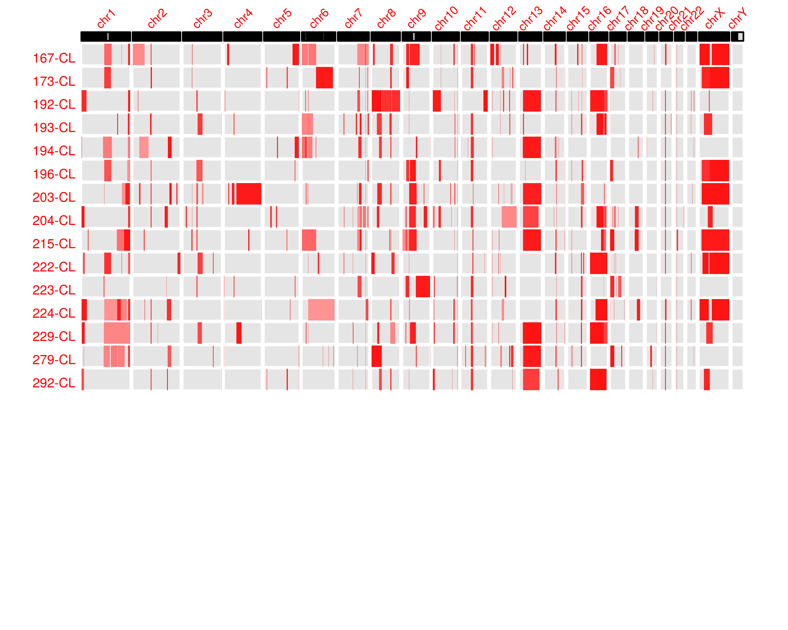

```{r setup, include=FALSE}
knitr::opts_chunk$set(echo = FALSE)
```

```{r echo=FALSE}

embed_data <- function(x= mtcars, filename= "file.csv", label= "Get data"){

  # Create encoded Base64 datastream 
  encode_data= function(x){
    write.table(x, "./file.csv", sep = ",", row.names = FALSE)
    enc= sprintf('data:text/csv;base64,%s', openssl::base64_encode(paste0(readLines("./file.csv"), collapse="\n")) )
    unlink("./file.csv")
    return(enc)
  }

  # String result ready to be placed in rmarkdown
  paste0("<a download='", filename, "' href=", encode_data(x), ">", label, "</a>")

}
```

## Intro
**General and brief background of retinoblastoma**
Retinoblastoma is a disease of the developing retina. Retinoblastoma is initiated, in most cases, by inactivation of two copies of the *RB* gene and subsequent loss of RB protein. The unique sensitivity of the developing retina to loss of RB results in tumor formation. Retinoblastoma can also form with amplification of the *MYCN* oncogene. Retinoblastomas of this type, termed *MYCNA* are less frequent and may be subject to alternative signaling pathways in the course of proliferation. 

**eventually noting progression-related changes which are …..and lack of understanding of what they do.**
Genetic changes to p16^INK4a^ and p130 have been suggested to drive Rb-/- pre-malignant retinomas to formation of Retinoblastoma[@dimaras_loss_2008]. The role of secondary mutations in progression of retinoblastoma has been previously studied, but the comparatively shallow depth of sequencing used may have limited detection of low frequency variants associated with progression of retinoblastoma[@kooi_somatic_2016]. 

**Lack of validated cell lines with known genetic background to explore Rb progression.**
Canonical retinoblastoma cell line models such as *Weri* and *Y79* are well characterized but are subject to genetic drift after long-term laboratory passaging. In addition, evidence indicates that Y79 and Weri lines share extensive genetic background such that Weri may be considered a sub-line of Y79 [@bejjani_rb116:_2012]. Models of RB^MYCNA^ are rare relative to canonical Rb -/- cell lines. A shortage of low passage, well-characterized retinoblastoma cell lines may limit study of complex genetic variants beyond the classical two-hit model, in particular *MYCNA* retinoblastoma.

**Detection of low frequency variants in heterogeneous tumors.**
We carried out exome sequencing on twelve retinoblastoma tumors along with matched normal and tumor-derived cell lines. We selected a sequencing depth of 150x for normal and cell line samples and 300x for tumor samples. We present supporting evidence for recently identified variants targeting *MYCN* and *BCOR* and SCNAs known to arise in retinoblastoma. We make available ten retinoblastoma cell lines with fully characterized genetic background. Finally, using two of the cell lines featured in the study, we investigate the impact of BCOR deletion and predicted BCOR loss-of-function mutations on growth of retinoblastoma cell lines. 

## Methods

### Samples 
Untreated retinoblastoma tumor samples were obtained with informed consent under approved IRB protocols immediately following enucleation. One fraction of tumor was rapidly frozen in liquid nitrogen. A second fraction was placed in culture to establish cell lines. Matched normal DNA samples were obtained from mesenchymal cells isolated from orbital fat pad tissue collected during enucleation.

### Establishing and propagating retinoblastoma cell lines 
Dissociated retinoblastoma cells were prepared after culturing freshly explanted tumors in RB culture medium consisting of IMDM (Mediatech Inc.) with 10% FBS (Sigma-Aldrich), 2mM glutamine (Mediatech Inc), 55uΜ beta-mercaptoethanol (Sigma-Aldrich), and 10ug/ml insulin (Humulin-R, Eli Lilly and Company) at 37o C in a humidified incubator with 5% CO2 [Xu, 2013]. 

### DNA isolation and Sequencing 
Flash-frozen tumor samples were dissociated by triteration and immediately prepared for DNA extraction. In the same fashion, cryopreserved cell lines and normal MSC samples were dissociated and DNA was isolated using the Qiaamp DNA Minikit (Qiagen, Hilden, Germany). A minimum of 1 ug of DNA was submitted for DNA Exome Sequencing on Illumina HiSeq by Macrogen Inc. (Seoul, South Korea) and BGI (Shenzhen, China). A sequencing depth of 150x for cell line and matched normal samples and 300x for tumor samples was requested. 

### Methods-Variant Calling Pipeline
Exome capture sites were defined according to the Sureselect V5 Capture Library (Agilent). Sequences were aligned to USSC hg19 human reference genome using bwa [@li_fast_2010]. Following the GATK best practices workflow for somatic variant discovery, duplicate reads were removed and quality scores were recalibrated. Variant calling was done using GATK Mutect2 for somatic variants between tumor and matched-normal samples.[@depristo_framework_2011; @bateman_fastq_2013]. Putative germline variants were assessed by assembling a panel of normals with mutect2 in variant detection mode. 

### Methods-Variant Filtration
Variants were removed if they were documented in the Genome Aggregation Database (gnomAD) @lek_analysis_2016 at an allele frequency greater than ten percent . All admitted variants were marked "PASS" by GATK. Variants were removed if they appeared in the matched normal at greater than Low frequency (<5% VAF ???) . Variants were also filtered out if they appeared in a panel of normals at Low frequency (<5% VAF ???) . Two variants were considered identical when they had identical genomic coordinates, reference and mutant allele sequences, and GATK genotype calls (AA, AB, BB). 

### Somatic Copy Number Alteration
Somatic copy number alteration (SCNA) were detected using the R package CopywriteR which uses off-target reads in targeted sequencing experiments [@kuilman_copywriter:_2015]. 

### Allelic Imbalance
Variant sites detected by Mutect2 in any sample were collected into a single .bed file. B allele frequencies for all samples were calculated at these sites. B allele frequency segmentation was performed as described @staaf_segmentation-based_2008, yielding a mirrored B allele frequencey(mBAF) representing an abnormal B allele frequency over a given region. A region was designated as having allelic imbalance if mBAF was greater than 0.56 and was designated as having loss of heterozygosity (LOH) if mBAF was greater than 0.7.  

## Results

### Cell Line Growth Curves


Retinoblastoma cell lines were established from enucleated tumor prior to treatment, then expanded in culture under either of two protocols (Reynolds and VC) and viably frozen at a minimum cell number. For this study, these initial cell lines were thawed and passaged on a schedule of 1-2 days upon color change of phenol red to amber. With an intial volume of 200 ul cell solution per 96 well plate, cells were split 1:2 wells following successive days of sufficient color change. A log of well number based on volume of a 96-well plate was maintained for each cell line, with the first value corresponding to the cumulative days in culture up to initial date of thawing, and correcting for cells banked in liquid nitrogen storage at regular intervals.  **Indicate range of cell # used to start cultures; All are pre-treatment , CHLA, established by either of two protocols (Reynolds and KS)** 

### RB patient characteristics
```{r patient_chars, echo=FALSE, results='asis'}
library(pander)
patient_chars <- read.table("patient_chars.csv", header = TRUE, sep = ",")
pander(patient_chars, split.cells = 30, split.table = Inf)
embed_data(patient_chars, filename="patient_chars.csv", label= '**Table 1: Patient Characteristics**')
```
Clinical characteristics of study participants. Clinical sequencing records for four of twelve samples are available in supplementary info, all rb1 clinical variants were recapitulated by exome sequencing with the exception of biallelic promoter methylation reported in sample T-20.

### RB1 Status in Tumor and Cell Line Samples

```{r rb1_status, echo=FALSE, results='asis'}
library(pander)
rb1_status <- read.csv("rb1_status.csv", header=TRUE, check.names = FALSE)
pander(rb1_status, split.cells = 30, split.table = Inf)

embed_data(rb1_status, file="rb1_status.csv", label = "**Table 2: RB1 and MCYNA status in Tumor and Cell Line Samples**")
```
Samples are displayed by tumor and cell line id. The estimated number of RB1 alleles subject to SCNA loss is displayed for each sample along with detected LOF mutations to *RB* with variant allele frequency (VAF). Also displayed are determinations of copy-neutral loss of heterozygosity (CN-LOH) with mBAF spanning *RB*. If a copy number gain spanning MYCNA was detected, the sample is labeled *MYCNA*. In most cases RB1 initiation could be accounted for by the sum of alterations in RB1 or through *MYCNA*, with the exception of samples 20-T and 20-CL. These samples were determined to be subject to *RB1* promoter methylation by clinical sequencing. 

### Somatic Variants
Following variant calling, a total of 643,581 variants were discovered. After filtering out variants that were found in the panel of matched normal controls, 16,348 (16,348/643,581; 2.5%) variants were recorded. After further filtering by pathogenicity, functional annotation, and variant allele frequency (VAF) in gnomAD, a final tally of 220 variants were found (679/16,348; 4%). Details can be found in *Table 3*.


### Somatic Variants Shared Between Tumor and Cell Line
```{r t_cl_vars, echo=FALSE, results='asis'}
library(pander)
m2_t_cl_vars_path <- "SNV/m2_t_cl_vars.csv"
strelka_t_cl_vars_path <- "SNV/strelka_t_cl_vars.csv"

t_cl_vars_path <- m2_t_cl_vars_path

t_cl_vars <- read.table(t_cl_vars_path, header = TRUE, sep = ",", check.names = FALSE, row.names = 1)
t_cl_vars <- data.frame(lapply(t_cl_vars, function(x) {gsub("-Inf", "", x)}))
pander(t_cl_vars, split.cells = 30, split.table = Inf)
embed_data(t_cl_vars, filename="t_cl_vars.csv", label= "**Table 3: Variants Recurrrent in Tumor and Cell Line Samples")
```
Somatic variants shared between matched retinoblastoma tumor and cell line samples included *RB1*, *PAN2*, *EP300*, and , recurrent in six of 12 samples. Additional SNVs including *BCOR*, previously identified @kooi_somatic_2016, @zhang_novel_2012 and *NAF1* were not detected in cell line samples but were found in tumor. Recurrent variants included *RB1* and *EP300*, closely related to *CREBBP* identified by @kooi_somatic_2016. Additional somatic variants exclusive to tumor and cell line samples can be found in supplementary info S1.


Indicate TTL5 changes as one variant 
Table with allele 
(Discussion: BCOR mutation in T28  ‘lost’ in CL 28; suggesting does not help and might hurt growth.  5 of 7 other CNAs were retained (all except 12-) suggesting that the rare BCOR wild type and chr12 normal cell was selected; suggesting that 12- and BCOR mutation were the last changes in the evolution of the tumor (consisstent with BCOR VAF = 0.394); suggesting either selection for two copies of chr 12 or for wild type BCOR.  [also check CL28 for CN-LOH]
(similar points for NAF1)

PAN2 AKAP12: mention increase VAF in cell lines – though not much can be made of it. DO indicate  likely effects of mutation on protein structure and function. 
If they are heterozygous in cancer cell may be dominant acting oncogenic or haplo-insufficent if mutation inactivates a tumor suppressor function. 
Discussion: note prior evidence for role in Cancer (AKAP12) but no prior papers for PAN2; how affects RNA metabolism/processing it may be consistent with Kooi observation that progression is associated with increased RNA biogenesis???
Are EP300 ‘mutations’ also found at very low frequency in other tumors, cell lines, normals in our cohort.


### Somatic Copy Number Alterations
Somatic copy number alterations (SCNA) were detected in all twelve samples. Regions of copy number change included 1q, 2p, 6p, 7q and 13q--conistent with [@kooi_meta-analysis_2016]. We detected amplification of 2p in the region spanning the MYCN oncogene in sample 24-T and matched cell line. We also found SCNA loss in sample 14-T on the X chromosome covering BCOR, previously implicated in retinoblastoma pathogenesis[@zhang_novel_2012, @kooi_somatic_2016]. 


### SCNA in Kooi peak regions

```{r , echo=FALSE, results='asis'}
vc_seg_overlap_path <- "SCNA/vc_seg_overlap_kooi_peaks.csv" 
vc_seg_in_kooi_peaks <- read.csv(vc_seg_overlap_path)
embed_data(vc_seg_in_kooi_peaks, file="vc_seg_overlap_kooi_peaks.csv", label = "SCNA overlap with Kooi et. al peak regions in vision center tumors and cell lines")
```

```{r , echo=FALSE, results='asis'}

reynolds_seg_overlap_path <- "SCNA/reynolds_seg_overlap_kooi_peaks.csv"
reynolds_seg_in_kooi_peaks <- read.csv(reynolds_seg_overlap_path)  
embed_data(reynolds_seg_in_kooi_peaks, file="reynolds_seg_overlap_kooi_peaks.csv", label = "SCNA overlap with Kooi et. al peak regions in reynolds cell lines")
```


### Allelic Imbalance Loss of Heterozygosity
Regions of loss of heterozygosity with a threshold of 0.7 mBAF are shown in [supplementary info](#supplementary-info-loss-of-heterozygosity). 





### Germline Variants

No germline RB1 mutations were detected for the 10 tumors from unilaterally affected patients, consistent with these patients having acquired two somatic RB1 alterations.   
One bilateral pt had 13q focal deletion that included the RB1 gene.  In addition, in a second bilateral case (VCRBVC41) we did not detect a germline variant. However, the tumor showed RB1 LOH, there is likely to be a hidden germline RB1 abnormality, such as promoter mutation (ref) or deep intron mutation (ref). As a less likely possibility, this patient could have a low-level mosaic mutation or promoter methylation that was not detected in the MSC DNA. However, mosaicism seems unlikely to yield bilateral tumors. (let’s check for low VAF changes in normal DNA).  [check Gallie/Lohmann paper and Rushlow MYCNA paper might mention other alternatives to explain lack of RB1 mutation detection) 

```{r potential_germline, echo=FALSE, results='asis', eval=FALSE}
library(pander)
germline_vars <- read.table("~/rb_pipeline/results/SNV/tidy_pon_rb.csv", sep = ",", header = TRUE)
embed_data(germline_vars, file="germline_variants.csv", label = "germline variants")
```


## Discussion

I. It appears that certain variants may drive tumorigenesis but that clonal selection may result in the development of secondary variants which, on their own, would be sufficient to induce tumorigenesis. Sample 24-T/24-CL provides an excellent example. Mycn amplification is evident in this tumor (figure # SCNA heatmap) but further selection for Rb loss in the case of the cell line indicates a survival advantage at least in the in vitro context. Compare CL and T SCNA and BAF plots.

We were able to identify the driver mutation for retinoblastoma initiation in ten of twelve cases. For the other two cases, we hypothesized that these tumors may have undergone promoter methylation. In the absence of deleterious alterations in Rb or Mycn, and with evidence of copy neutral loss of heterozygosity, it is possible that promoter methylation to Rb and subsequent CN-LOH, could have functionally inactivated both copies of Rb. In the case of 20-T we consulted clinical sequencing records which indicated promoter methylation of Rb. It is possible that tumor T-41 may also have undergone promoter methylation.


* 49 16q CN-LOH b/w tumor and cell line is interesting

* Is there a very focal 16q deletion present? Need to line up SCNA and BAF plots over 16q and identify genes in loss regions. (in 33-T especially; 20 also a good example)
<!--  -->

* 46-T Akap12 increases in frequency despite no apparent SCNA gain or CN-LOH in 6p gain

* What is wt VAF of BCOR in 28-CL?

AD.TUMOR.1 | AD.NORMAL.1 | AD.TUMOR.2 | AD.NORMAL.2
----|----|---|---	
113 | 86 | 3 | 0

* 31-CL and/or 14-CL could have BCOR added back as well as possibly 33

* Point out NAF1 as being found in MCYNA tumor 

* fix 43 patient info

* correct SCNA plots at X chromosome

* mention PAN2 in the abstract 

* comment about each novel recurrent mutation in discussion section, note: prior relevance to cancer, fits any models?. Stress that further exome seq likely to reveal additional novel recurrences. Establishment of cell lines and pdx is warranted. 
    + PAN2: PAN2 [poly(A) nuclease 2]/USP52 (ubiquitin-specific protease 52) is a regulator of the master transcritptional regulator HIF1A [@bett_p-body_2013]. Differential expression with fold change of 3.1 has been reported for USP52/KIAA0710 mRNA in renal-cell cancer [@hu_differential_2003]. 
    + NAF 1


See PMID: 27881443 for EP300 mutations in cancer.
Discussion: describe new recurrent changes, and value of seq more samples for more recurrent change detection.

Cell line - Tumor Comparisons
We noticed ……….(this never done before for retinoblastoma  -=- especially want to know if there were recurrent (in our dataset or with others) CNAs or SNVs needed to establish in culture). 

CNA and SNVs – shared, lost in cell line, gained in cell line.
Polyclonality???
Check PE300 for artifact, perhaps in Kooi as well. 

### RB1 Hits 
The number of 

1. 
Previous studies have found that somatic genomic alterations are rare in retinoblastoma [@kooi_somatic_2016]. Our findings are that retinoblastoma variants are almost exclusively within the RB1 gene. We did not find a dramatic increase in recurrent copy number changes despite our aim for increased sequencing depth. The most common variants 

#####

### Supplementary Info Somatic Variants in Vision Center Tumors
```{r t_vars, echo = FALSE, results='asis'}

vc_tumor_var_path <- "~/rb_pipeline/doc/SNV/clean_vc_tumor_variants.txt"
# vc_tumor_var_path <- "~/rb_pipeline/doc/SNV/tumor_variants.csv"
t_vars <- read.table(vc_tumor_var_path, header = TRUE, sep = ",")
embed_data(t_vars, filename="t_vars.csv", label= "variants in tumors") 

```

### Supplementary Info Somatic Variants in Vision Center Cell Lines
```{r 4, echo = FALSE, results='asis'}
vc_cell_line_var_path <- "~/rb_pipeline/doc/SNV/clean_vc_cell_line_variants.txt"
# vc_cell_line_var_path <- "~/rb_pipeline/doc/SNV/cell_line_variants.csv"
cl_vars <- read.table(vc_cell_line_var_path, header = TRUE, sep = ",")
embed_data(cl_vars, filename="cl_vars.csv", label= "variants in cell lines") 
```

### Supplementary Info Somatic Variants in Reynolds Cell Lines
```{r 5, echo = FALSE, results='asis'}
reynolds_cell_line_var_path <- "~/rb_pipeline/doc/SNV/clean_reynolds_cell_line_variants.txt"
# reynolds_cell_line_var_path <- "~/rb_pipeline/doc/SNV/cell_line_variants.csv"
cl_vars <- read.table(reynolds_cell_line_var_path, header = TRUE, sep = ",")
embed_data(cl_vars, filename="reynolds_cl_vars.csv", label= "variants in cell lines") 
```


#####

#To Do

Create visualization of mBAF regions (similar ot SCNA heatmap)
Mention STR in results/methods

##	Discussion section
1.	Develop discussion section regarding evolution of tumor 24 (mycn amp but 13q loss only in cell lines; presence of somatic mutation in 13q cell line?)
2.	Add BCOR to where deleted in 14-T, 31-T. Interested in discovering effect as evidenced by 28-T/28-CL discrepancy CHeck for BCORL1 in kooi variants and tidy_vars_tumors
3.	Identify oncogences selectively increased in VAF in cell lines
4.	Look up PAN2 and NAF1 in unfiltered results
##20170824
1.	Should I do 16q loss correlation with tumor clonality as Kooi did?
## 20170821
1.	Find BCOR in 28-CL
1.	provided spreadsheet detailing presence of BCOR in cell lines

## 20170905
1.	Introduction (bullet points)
2.	Need to check Nautica submitted grant copy
3.	Results

4.	Culture conditions not established
1.	Cell Lines
5.	Variants of SCNA in
1.	T/N
2.	Are variants in CNV target regions
3.	In that tumor?
4.	In Irsan meta-analysis
6.	Are these mutations previously found as private?
7.	SCNA copy number changes
1.	Previously id’d by Kooi et al
2.	Characterize “sub” sCNA in tumors
1.	Relative to Kooi data
8.	Specific changes in CL for either
1.	SCNA
2.	Bases
## 20170903

2.	Need to find Irsan’s candidate targets in chromosome 7 and 11 more so others. none in chr11 **These included
3.	Kooi data includes candidates at less than het levels? YES ABSOLUTELEY
4.	What percent of samples are germline/hereditary? for RB mutations?

## 20180716

Check that integer counts present in all growth curves
check RNA in 20-CL for presenc of RB (to verify pro methylation)
check if expression changed in Zhang et al 

Reference Vogelstein landscapes for frequency of mutation in retinoblastoma--would unimportant variants be enriched in RNA-seq data from Retinoblastoma cell lines

RB cell line growth curves
  write in text "one vial to one well explains choice of y-axis"
  
  check integer counts
  
SCNA plots
  confirm chrx and chry in SCNA plots--in reynolds and VC plots
  
  explain XX and YY in reference and determine resolution of SCNA (20kb)
  
  check if all 4 suspected reynolds lines and mycn amp noted
  
  reference gallie, who has tracked conidcidence of MYCN amp and loss of RB

  check Kooi sci reports summary

  Berry uses SCNA plot for RB SCNAs
  write that "SCNAs shared b/w reynolds SCNA, VC SCNA and compare ot Kooi SCNA composite"
  
  check calculated SCNA at 6p in 41-T/CL relative to rb variant(?)
  
  set ceiling on gain in SCNA color scale

  
SNVS
  make summary plot of VAFs in:
    reynolds CL
    VC  T
    VC CL
    
  make section in results:
    SNVS recurrrent in [other authoer analysis]
      VC tumors or t/cl in Kooi
      VC CL in Kooi
      Reynolds CL in Kooi
  % vars in VC CL recurrent to tumors
  
  look at 49-T for BCOR variant
    make a section in discussion whether this recurrent variant in progression related (there is reason for doubt given the unusual case of 49-T)
    
  need a couple of sentences about each new recurrence in discussion
  
  need to provide RB VAF or SCNA as representation of percent stroma in tumor sample with each new recurrent variant
  
  create own paragraph devoted ot VBOR recurrence not found in a given matched T or CL
    check if 28-T or 33-T are male or female
    
  create a discussion section paragraph describing the overall relationship between recurrent changes and tumor progression
    mention that "we're not lookin at epigenetic changes in other genes." This is a limitation of our study
    
  The average number of tumors in a bilateral case of retionblastoma is five
  
  
  make a table of all nonrecurrent variants from all prior studies
  
  
    
LOH
  state resolution of LOH analysis from bafsegmentation
  
  up window size of bafsegmentation for reynolds samples
  
Extra
  potentially look for promoter methylation in 20-T/CL and 41-T/CL
  
  followup with Brianne about 41-T/CL Rb test
    is 41-T unilateral or bilateral?
  

## References

